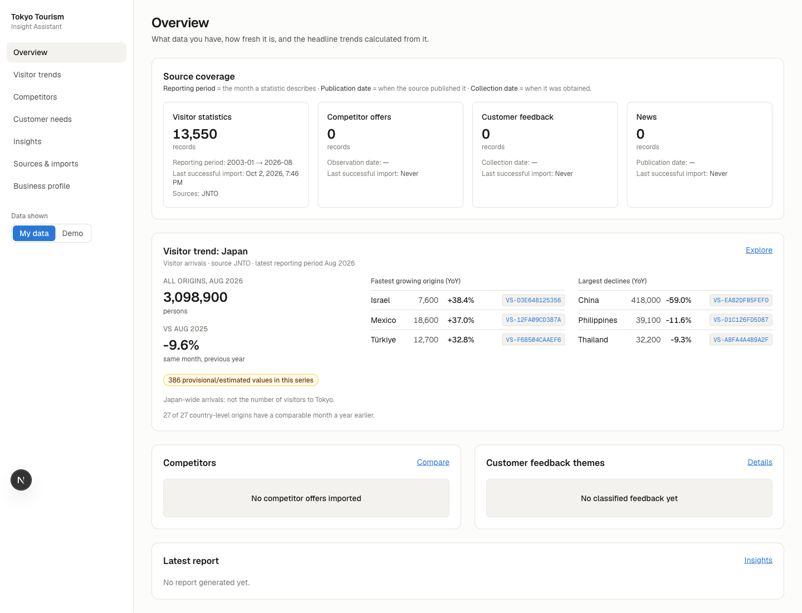

# Tokyo Tourism Insight Assistant

A local app for someone deciding **which tourism business to start in Tokyo**. It keeps Japan's official
statistics up to date by itself (JNTO visitor arrivals, Japan Tourism Agency visitor spending), calculates trends
in Python, and (optionally) asks a language model to turn **verified numbers and cited evidence** into a ranked
list of business ideas that fit your budget, skills and goals. Competitor offers, guest feedback and news can be
added too.

**Two roles, kept separate:** the *user* of this app is the founder. The *customers being studied* are
international visitors.



---

## 1. Requirements (macOS)

| Tool | Version used | Notes |
|---|---|---|
| macOS | 26 (Apple silicon) | Intel Macs work the same way |
| Python | **3.11+** (tested 3.11.5) | `anthropic` 1.x needs ≥ 3.10. The system `python3` on this Mac is 3.8 — use `python3.11` |
| Node.js | **22 LTS** (tested 22.21.1) | Next.js 16 needs ≥ 20.9. Node 25 also works but is not LTS |
| npm | comes with Node | |

If you need them:

```bash
# Python 3.11 (pick one)
brew install python@3.11            # or install from https://www.python.org/downloads/

# Node 22 LTS via nvm (already installed on this Mac)
nvm install 22 && nvm use 22
```

## 2. Install

```bash
cd ~/tokyo-tourism-insight-assistant

# Backend
cd backend
python3.11 -m venv .venv
source .venv/bin/activate
pip install -r requirements-dev.txt
cp .env.example .env               # optional: add ANTHROPIC_API_KEY for live AI
python -m app.seed                 # load the SYNTHETIC demo data into data/demo.db
deactivate
cd ..

# Frontend
cd frontend
npm install
cd ..
```

## 3. Run (two terminals)

```bash
# Terminal 1 – API on http://localhost:8000  (docs at http://localhost:8000/docs)
cd ~/tokyo-tourism-insight-assistant/backend
source .venv/bin/activate
uvicorn app.main:app --reload --port 8000
```

```bash
# Terminal 2 – web app on http://localhost:3000
cd ~/tokyo-tourism-insight-assistant/frontend
nvm use 22
npm run dev
```

Open <http://localhost:3000>. Use the **My data / Demo** switch in the sidebar.

### Tests

```bash
cd backend && source .venv/bin/activate && pytest -q      # 80 tests
cd frontend && npm run lint && npx tsc --noEmit && npm run build
```

## 4. First real data

### Automatic: official statistics

On **Add your data → Official data**, choose **Check for new data now**. The backend reads two public pages and
downloads only files it hasn't imported yet, through the normal import pipeline, into the real database:

| Source | What | Files |
|---|---|---|
| JNTO | Monthly visitor arrivals by nationality | The one current workbook |
| Japan Tourism Agency | Quarterly visitor spending survey (インバウンド消費動向調査) | National tables and prefecture tables, 2024-Q2 onward (earlier quarters used a different survey design) |

The backend also checks by itself every `AUTO_UPDATE_HOURS` hours (default 24; set `0` in `backend/.env` to
turn it off). The first check downloads about 18 files (around 30 seconds). Preliminary spending figures (速報)
are revised in place when the final release appears, and old values stay in each record's revision history.

**History, 2010 to early 2024 (one-off).** Under *Official data*, **Download history** fetches about 50 more
quarterly files: 2018 to March 2024 from the Japan Tourism Agency page, and 2010–2017 (plus January–March 2020)
from the National Diet Library's web archive (WARP) copy of the old MLIT page, the only place they are still
published. They are stored as separate survey designs (`source` = `JTA (2010-2017 design)` /
`JTA (2018-2024 design)`) and appear in **Spending → The long view**, drawn as separate line segments. They are
never used for year-on-year comparisons; the AI only receives change *within* one design, labelled as such. The 2010–2017 files are read at category level only
(items were grouped differently then). April 2020 to September 2022 has no usable category data (COVID-19).

### Manual: the JNTO workbook

1. Download the monthly “訪日外客数（総数）” XLSX from
   <https://www.jnto.go.jp/statistics/data/visitors-statistics/> (manually, in your browser).
2. In the app: **Sources & imports** → Dataset *Visitor statistics* → File format *JNTO monthly visitor arrivals
   workbook* → choose the file **without renaming it** (its name contains the publication date) → *Validate & import*.
3. Import the same file again: you will see `0 new, 13,550 duplicates`.

Other data uses the CSV templates (download them on the same page, or find them in `backend/templates/`).
`*_example.csv` files contain one example row each.

### How business ideas are reasoned

Before the AI sees anything, the app computes (in `backend/app/analysis/signals.py`):

- a **demand scorecard** per spending item: size (estimated market), growth vs the same quarter last year, and
  steadiness (in how many of the last five quarters it grew), combined into a 1–5 score whose parts are shown;
- **Tokyo's share** of each spending category (against the 47 prefectures added up) and how it moved;
- **seasonal peaks** per category in Tokyo, and **long-term change within each survey design**.

The AI is asked to work through these in order (scan the signals, check Tokyo, generate candidates across
business types, filter by *About you*, rank), to link each idea to the items it depends on, say *why now*, rate
the fit with you, and list the obvious ideas it rejected and why. The page shows the app's scorecard next to each
idea, so the reasoning can be checked against the numbers. On **Spending**, *Strongest demand signals* shows the
same scorecards without needing an API key.

### Free local AI (open source, runs on your Mac)

Business ideas can be written by an open-source model on your own computer: no API key, no cost, and nothing
leaves your Mac. It uses [Ollama](https://ollama.com) and **Qwen 2.5 14B** (Apache 2.0 licence, about 9 GB).

```bash
brew install ollama
brew services start ollama          # runs in the background, also after restarts
ollama pull qwen2.5:14b             # one-off download
```

Then **Business ideas → Find ideas with local AI (free)**. A report takes a few minutes on an M1 Max with 32 GB.
Expect less depth than Claude; the same citation checks remove any idea that cites evidence that doesn't exist.
Settings in `backend/.env`: `LOCAL_MODEL` (e.g. `qwen2.5:32b` for better quality if you have the memory),
`OLLAMA_URL`, `LOCAL_TIMEOUT_SECONDS`, `LOCAL_CONTEXT_TOKENS`.

### Optional: live AI

Put your key in `backend/.env`:

```
ANTHROPIC_API_KEY=sk-ant-...
ANTHROPIC_MODEL=claude-opus-5
```

Restart the backend. **Business ideas → Find business ideas with AI** and **Guest feedback → Sort with AI** become
available. Fill in **About you** first, so ideas fit your budget, time and skills. Both call a paid API; request sizes are capped (see `.env.example`).
The key is only read by the backend and never sent to the browser.

### Reset

```bash
rm -rf backend/data                 # deletes BOTH databases and preserved uploads
cd backend && source .venv/bin/activate && python -m app.seed   # recreate demo data
```

---

## 5. How it works

### Data flow

```
 file / feed ─► preserve original (data/raw/<scope>/<sha>_name)          never modified
            ─► read (CSV / XLSX / JNTO adapter / RSS)
            ─► validate every row ──any error──► reject whole file, list errors by row + column
            ─► upsert by stable evidence ID     new → insert · same → duplicate · revised → update + revision history
            ─► SQLite: data/real.db  or  data/demo.db   (chosen by `scope`; never mixed)
                      │
                      ▼
  analysis/stats.py (pandas)   monthly grid, MoM / YoY only when comparable period exists,
                               shares with zero-safe denominators, sample sizes
                      │
                      ├──► dashboard API → Next.js views (charts, tables, evidence drawer)
                      ▼
  ai/evidence.py   evidence pack = numbered facts (F1…, each listing its record IDs)
                   + bounded documents (feedback/news/offers, marked untrusted) + data gaps
                      │
  ai/provider.py   AnthropicProvider (structured JSON output)  |  DemoProvider (fixed rules, "EXAMPLE")
                      │
  ai/report.py     schema validation → citation check (in pack AND in database) → store report + exact pack
```

### Key decisions (and why)

| Decision | Why |
|---|---|
| **Two database files** (`real.db`, `demo.db`) instead of a flag column | Synthetic rows cannot leak into real analysis by a forgotten `WHERE`. Demo IDs also start with `DEMO-`. |
| **Evidence ID = hash of the natural key** (e.g. source + geography + origin + metric + unit + month) | Re-importing gives the same IDs, so duplicates are detected and report citations stay valid. |
| **All-or-nothing imports** | A half-imported file would silently skew counts. Fix the file and re-import; duplicates make that safe. |
| **Blank = missing** everywhere | JNTO leaves unpublished months blank; storing nothing (not 0) keeps charts and YoY honest. |
| **Numbers computed in Python, not by the model** | The model only receives fact statements; it is told not to do new arithmetic. |
| **Citations checked twice** | IDs must be in the pack that was sent *and* exist in the database; otherwise the insight is removed and the removal is shown. |
| **Plain `sqlite3`, no ORM; no vector DB; no agent framework** | Fewer concepts to learn; the SQL is visible in the code. Retrieval is ordinary queries. |
| **Example reports only in demo scope** | An example must never look like an analysis of real data. |

### Module map

```
backend/app/
  main.py               FastAPI app + router registration
  config.py             settings from env / backend/.env
  db.py                 SQLite connections per scope, schema init, known sources
  schema.sql            tables (dates: reporting_month / publication_date / collection_date)
  seed.py               loads demo_data/*.csv through the normal import pipeline
  importers/
    common.py           strict parsers: months, dates (no DD/MM guessing), numbers, durations, evidence IDs
    datasets.py         columns, validation, natural keys, revisable fields per dataset
    service.py          the import pipeline (preserve → validate → upsert → batch record)
    jnto.py             JNTO monthly workbook adapter (JP labels → EN, italics → estimate)
    feeds.py            single permitted RSS/Atom feed fetch (timeout, 2 MB cap)
    templates.py        CSV templates generated from datasets.py
  analysis/
    stats.py            series, MoM/YoY, origin comparison, competitor + theme summaries, coverage
    themes.py           fixed theme taxonomy + offline keyword classifier
  ai/
    schemas.py          Pydantic output contracts (insight fields, theme labels)
    evidence.py         retrieval: builds the bounded evidence pack
    prompts.py          system prompts (roles, untrusted data, no invented numbers…)
    provider.py         provider interface, Claude implementation, demo provider, error mapping
    report.py           generate → validate → store
    classify.py         batched feedback classification
  routers/              thin HTTP endpoints per screen
backend/tests/          pytest suite
backend/templates/      import templates
backend/demo_data/      SYNTHETIC data + generator script

frontend/src/
  app/                  one folder per view: / trends competitors needs insights sources profile
  components/
    providers.tsx       scope (real/demo) + evidence drawer context
    shell.tsx           navigation, scope switch, DEMO banner
    evidence-drawer.tsx trace a fact or record to file, batch, source terms, revisions
    charts.tsx          Recharts line (gaps for missing months) and bar charts, table view
    ui.tsx              cards, badges, loading / empty / error states
  lib/                  API client, types, formatting (missing → "—"), useApi hook
```

### Optional: train your own feedback classifier (free, runs on your Mac)

`backend/app/local_model/` fine-tunes [`xlm-roberta-base`](https://huggingface.co/FacebookAI/xlm-roberta-base)
(MIT license, English + Japanese) on feedback **you** have labelled. It predicts the same themes as the keyword
rules and the language model, plus a sentiment, and stores its labels with method `local`. No API costs.

```bash
cd backend && source .venv/bin/activate
pip install -r requirements-ml.txt                  # torch + transformers (~1 GB)

python -m app.local_model.labels --scope real       # 1. writes data/training/labels_real.csv
#   open it in Numbers/Excel: fix `themes` (keys separated by ;) and `sentiment`, set reviewed=yes
python -m app.local_model.train                     # 2. ~1-5 min on Apple silicon; downloads the base model once
python -m app.local_model.predict --scope real      # 3. labels all feedback (or "Run trained model" in the UI)
```

- Only rows marked `reviewed=yes` are used. Re-running step 1 keeps your edits and appends new feedback.
- At least 20 reviewed rows are required; aim for **300+** for useful results.
- Training holds back 20% of rows and prints the model's score next to the keyword rules on those same rows.
  Only switch to the trained model if it clearly beats them.
- The labelling sheet and the model (~1.1 GB) live under `backend/data/`, which is not committed.

---

## 6. Data sources and usage conditions (checked 2 Oct 2026)

| Source | What we found | How the app uses it |
|---|---|---|
| JNTO visitor statistics (<https://www.jnto.go.jp/statistics/data/visitors-statistics/>) | Monthly arrivals by nationality as XLSX/PDF, no API. Citation allowed if credited as “日本政府観光局（JNTO）”, no notification needed. The statistics portal (<https://statistics.jnto.go.jp/en/>) asks for a usage application form for published/media use. | Manual download + dedicated importer. Attribution shown on every record. |
| Japan Tourism Agency spending survey (<https://www.mlit.go.jp/kankocho/tokei_hakusyo/gaikokujinshohidoko.html>) | Quarterly XLSX/XLS tables, no API. MLIT site content may be reused under the Public Data License (公共データ利用規約 PDL1.0) with the source credited (checked 7 Oct 2026). No robots.txt restrictions. | Automatic check (one page request, then only new files) + dedicated importer. Survey estimates: respondent counts are stored and small samples flagged. |
| Tokyo Tourism Data Catalog (<https://data.tourism.metro.tokyo.lg.jp/en/>) | Dashboards and downloadable survey data; file formats and licence terms were **not stated** on the pages checked. | No automated collector. Confirm the dataset’s terms, then use the visitor-statistics CSV template with `geography = Tokyo`. |
| Competitor offers | Public listings, entered by hand. | CSV template. Do not scrape sites whose terms forbid it. |
| Feedback | Only data you may use; `permission_basis` is required per row. | CSV template. Remove names/emails first. |
| News | Manual CSV, or one RSS/Atom feed whose terms you confirm. Titles + short excerpts only. | CSV template / feed form. |

**Interpretation rules built into the app:** Japan-wide arrivals ≠ Tokyo visitors; nationality ≠ preferred tour
language; frequency of a theme or positive sentiment ≠ willingness to pay; spending data shows demand, not
competition, costs or permits. Item-level spending exists for Japan as a whole only; Tokyo has 7 broad
categories. Estimated market sizes (spend per visitor × arrivals) are labelled as estimates.

---

## 7. What was verified, and how

| Area | Verified with | Real or simulated? |
|---|---|---|
| JNTO import | The actual JNTO workbook published 2026-09-16 (2003-01 → 2026-08), imported through the UI: 13,550 rows; second import 0 new / 13,550 duplicates; US Dec 2025 = 270,704 matches the sheet | **Real file** |
| CSV validation, duplicates, revisions, conflicts | pytest with small CSV fixtures | Fixtures |
| Date parsing, missing periods, zero denominators, percentages | pytest | Fixtures |
| Real/demo separation | pytest (API-level) + browser | Fixtures + demo data |
| Invalid AI output, nonexistent citations, IDs missing from the DB | pytest with fake providers | **Mocked** |
| API failures (timeout, network, 429, 401, 500, refusal, truncation, bad JSON) | pytest with a fake Anthropic client | **Mocked** |
| Live Claude calls | **Not tested** — no API key was available. Request shape (structured output, fallbacks, bounded tokens) checked against the installed SDK signature and asserted in tests | Not run |
| RSS import | Parser tested with an inline feed fixture; no live feed fetched | Fixture |
| Main journey (import → trend → offers → themes → report → evidence) | Playwright in Chromium against the running app; see `docs/screenshots/` | Real JNTO data + demo data |

The first time you add a key, run one report on demo data (“Live AI on demo data”) and check the Validation
card before relying on real reports.

---

## 8. Known limitations

- **Live AI path is untested against the real API** (see above).
- **Keyword themes are crude** (e.g. “booked” → booking & logistics). They are labelled as such; use AI labels when available and spot-check them.
- The model may still phrase claims loosely. Citations are checked, but the app does not verify that every sentence is supported by the cited text.
- YoY for small markets swings a lot (e.g. +38% on 7,600 visitors). Values are shown next to percentages; there is no minimum-size filter.
- Recent JNTO months are estimates/provisional; comparing them with final figures from a year earlier is flagged but not adjusted.
- No Tokyo-specific importer yet (catalog formats/licence unclear) — use the CSV template.
- Single user, no authentication; designed to run only on your Mac (`localhost`).
- Reports run synchronously; a slow API call keeps the request open (up to the timeout × retries).
- Deleting records is not supported in the UI (delete `backend/data/` to start over).

## 9. Sensible next steps

1. Add an API key and run one live report on demo data; review the validation output.
2. Collect 30+ pieces of permitted feedback and run AI classification; compare with keyword labels.
3. Record 10–20 competitor offers in your operating area.
4. Add a Tokyo dataset from the TMG catalog once you have confirmed its licence.
5. Add a minimum-base filter for YoY rankings and an "estimate vs. final" note on comparisons.
6. Optional: a sentence-level “claim check” prompt, a background job for long reports, and a delete/undo for import batches.
